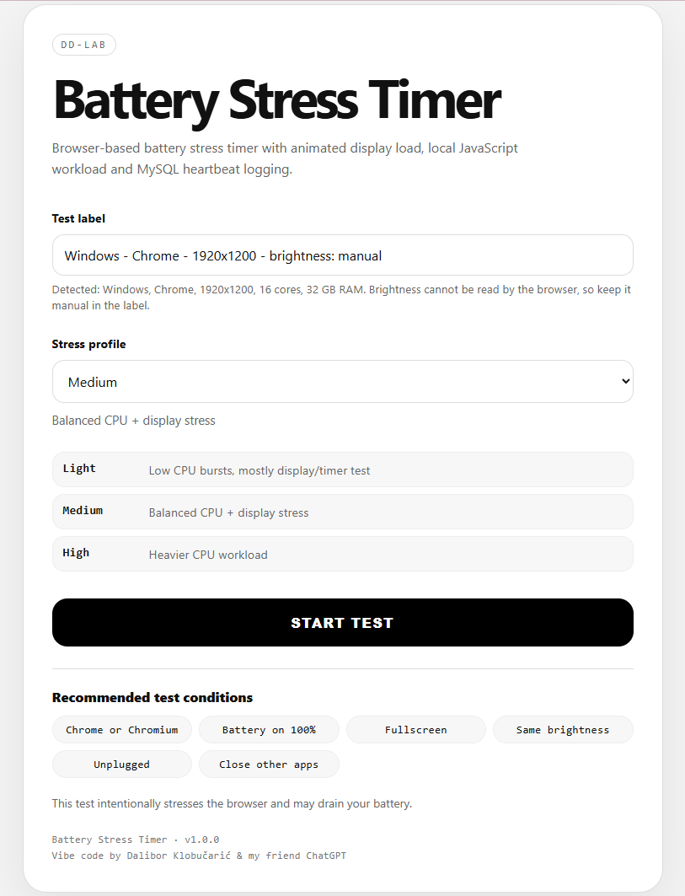
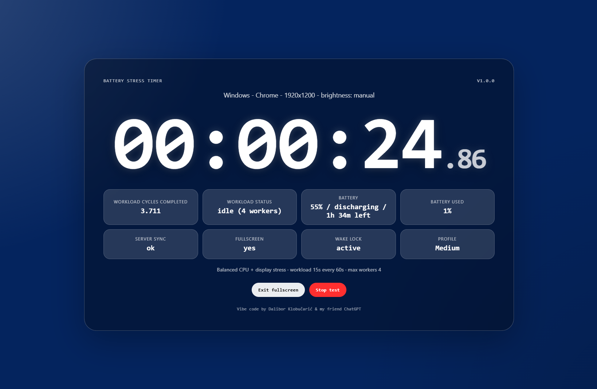
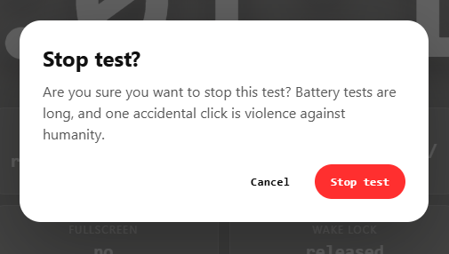
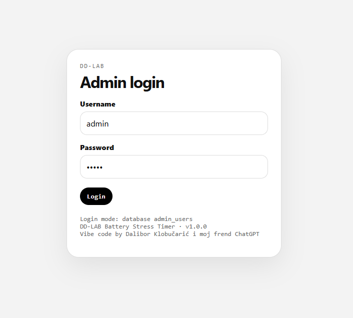
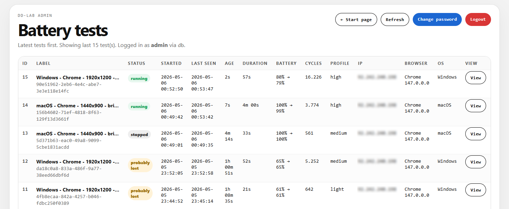
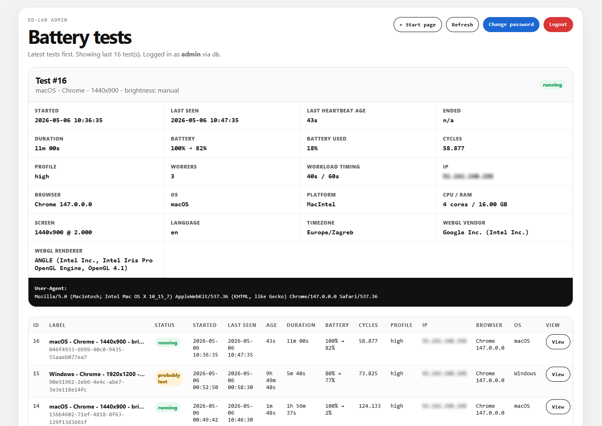
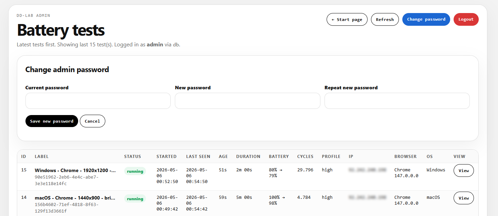

# Battery Stress Timer

A self-hosted PHP + JavaScript browser-based battery stress timer with animated display load, local Web Worker CPU workload, battery telemetry, MySQL heartbeat logging, and a simple admin dashboard.

The project is designed for comparing laptop battery/runtime behavior under repeatable browser-based workload conditions.

---

## What is this?

Battery Stress Timer is a small self-hosted web app for running battery stress tests directly inside a browser.

You open the app on a laptop, choose a stress profile, start the test, and let the browser run. The app displays a large fullscreen-style timer, gently animates the background, runs periodic local JavaScript workload through Web Workers, reads battery telemetry when supported, and saves test progress to MySQL through heartbeat updates.

It is especially useful for comparing devices under similar conditions, for example:

- same browser
- same URL
- same screen brightness
- same stress profile
- unplugged power adapter
- closed all tabs besides timer
- closed background apps

---

## Features

- Large monospace timer with centiseconds
- Smooth animated background display load
- Selectable stress profiles:
  - Light
  - Medium
  - High
- Local CPU workload using JavaScript Web Workers
- Workload cycle counter
- Battery telemetry when supported by the browser
- MySQL logging
- Heartbeat updates every 60 seconds
- Admin dashboard
- Manual stop button
- `probably lost` detection for interrupted tests
- Fullscreen button
- Wake Lock support where available
- Cross-platform browser fallback behavior
- Simple PHP + vanilla JavaScript codebase
- No frameworks
- No external dependencies

---

## Screenshots

```markdown







```

---

## Requirements

Server side:

- PHP 8.x recommended
- MySQL or MariaDB
- Apache recommended
- PDO MySQL extension enabled

Browser side:

- Chrome / Chromium / Edge / Opera recommended
- Firefox works for timer/workload/server sync but does not expose battery telemetry
- HTTPS recommended for production use

---

## Recommended test conditions

For comparable results, use the same conditions on all tested devices:

- Same browser
- Same test URL
- Same stress profile
- Same screen brightness
- Power adapter unplugged
- Close unnecessary background apps
- Use fullscreen if possible
- Start from a known battery percentage, ideally 100%
- Close all tabs in browser

---

## Installation

### 1. Upload files

Upload the project files to your web server directory, for example:

```text
/var/www/btstm/web
```

Or for local testing on WAMP/XAMPP:

```text
C:\server\www\btstm
```

---

### 2. Create database and user

Create a MySQL/MariaDB database and user.

Example:

```sql
CREATE DATABASE btstm CHARACTER SET utf8mb4 COLLATE utf8mb4_unicode_ci;

CREATE USER 'btstm'@'localhost' IDENTIFIED BY 'change_this_password';

GRANT ALL PRIVILEGES ON btstm.* TO 'btstm'@'localhost';

FLUSH PRIVILEGES;
```

---

### 3. Import database structure

Import only:

```text
install.sql
```

This file creates all required tables, including:

- battery test records
- admin users
- default admin account

Example:

```bash
mysql -u btstm -p btstm < install.sql
```

Or import `install.sql` through phpMyAdmin.

---

### 4. Configure `config.php`

Edit `config.php` and set your database credentials:

```php
'db' => [
    'host' => 'localhost',
    'name' => 'your_database_name',
    'user' => 'your_database_user',
    'pass' => 'your_database_password',
    'charset' => 'utf8mb4',
],
```

The included `config.php` contains dummy credentials for GitHub/public release.

Never commit real production passwords to a public repository!

---

### 5. Apache hardening

If you use Apache, rename:

```text
htaccess.txt
```

to:

```text
.htaccess
```

The `.htaccess` file adds basic production hardening such as:

- disabling directory listing
- blocking access to sensitive files
- blocking SQL files
- blocking dotfiles
- adding security headers where supported

If you use Nginx, `.htaccess` files are ignored and equivalent Nginx rules must be configured manually.

---


## Admin login

Default admin account after importing `install.sql`:

```text
username: admin
password: admin
```

Change this password immediately after first login.

Admin panel:

```text
/admin.php
```

---

## Changing the admin password

After logging into the admin panel:

1. Click **Change password**
2. Enter the current password
3. Enter the new password
4. Repeat the new password
5. Save

Passwords are stored using PHP password hashing.

---

## Admin fallback mode

`config.php` contains an optional fallback admin mode:

```php
'admin' => [
    'fallback_enabled' => false,
    'fallback_user' => 'admin',
    'fallback_pass' => 'admin',
],
```

When:

```php
'fallback_enabled' => true
```

the admin login uses the fallback credentials from `config.php`.

When:

```php
'fallback_enabled' => false
```

the admin login uses the `admin_users` database table.

Recommended:

```text
Development/local testing: fallback can be useful
Production/public server: fallback_enabled must be false
```

Do not leave fallback `admin/admin` enabled on a public server.

---

## Emergency admin password reset

If you lose access to the admin panel, you can reset the default admin user back to:

```text
username: admin
password: admin
```

Run this SQL query manually in MySQL/MariaDB:

```sql
UPDATE admin_users
SET password_hash = '$2y$12$m838rvTzAk3nCy0dlw9A0.GwpTJ7bCFFxPWL3h6ChrejaxjWdg3Qa',
    is_active = 1
WHERE username = 'admin';
```

After logging in, change the password immediately from the admin panel.

Do not leave the default `admin/admin` credentials enabled on a public server.

---

## Test statuses

The admin panel uses practical test states:

- `running` — the test is still alive and sending heartbeat updates.
- `stopped` — the user clicked **Stop test** and the result was saved cleanly.
- `probably lost` — the test disappeared without a clean stop. Most likely the browser was closed, the computer went to sleep, the battery died, or the network connection dropped.

For battery tests, `probably lost` is not necessarily an error. It can be the expected final state when the tested device runs out of battery.

By default, the admin panel marks a running test as `probably lost` when no heartbeat has been received for about two heartbeat intervals.

---

## Heartbeat behavior

The app writes a test record immediately when a test starts.

After that, it sends heartbeat updates every 60 seconds by default.

Heartbeat updates save:

- elapsed time
- workload cycles completed
- last known battery percentage
- charging/discharging state
- last seen timestamp

When a browser tab is closed, the app also attempts a final best-effort heartbeat using `sendBeacon`.

This final heartbeat is not guaranteed by the browser, but it improves the chance of saving the last known state.

---

## Stress profiles

The default profiles are:

| Profile | Description | Workload |
|---|---|---|
| Light | Low CPU bursts, mostly display/timer test | 5s workload every 60s |
| Medium | Balanced CPU + display stress | 15s workload every 60s |
| High | Heavier CPU workload | 40s workload every 60s |

The workload is executed locally in the browser using Web Workers.

One completed mathematical batch equals one workload cycle.

The app displays:

```text
Workload cycles completed: XXXXX
```

This number can be used as an approximate measure of how much browser-side work was completed during the test.

---

## Browser compatibility

Recommended browsers:

- Chrome / Chromium
- Microsoft Edge
- Opera

Firefox is supported for the timer, workload test and server logging, but battery telemetry is unavailable because Firefox does not expose the Battery API.

### Tested browsers

| OS | Browser | Timer | Workload | Server sync | Battery telemetry | Notes |
|---|---|---|---|---|---|---|
| Windows | Chrome | ✅ | ✅ | ✅ | ✅ | Fully working |
| Windows | Edge | ✅ | ✅ | ✅ | ✅ | Fully working |
| Windows | Opera | ✅ | ✅ | ✅ | ✅ | Works well; may be detected as Chromium |
| Windows | Firefox | ✅ | ✅ | ✅ | ❌ | Battery API unavailable |
| Linux | Chrome / Chromium | ✅ | ✅ | ✅ | ✅ / depends | Works; battery telemetry depends on device/browser |
| Linux | Firefox | ✅ | ✅ | ✅ | ❌ | Battery API unavailable |
| macOS | Chrome | ✅ | ✅ | ✅ | ✅ | Main target browser for MacBook battery tests |
| macOS | Safari | ✅ | ✅ | ✅ | ❌ / limited | Battery telemetry may be unavailable |

---

## Battery telemetry note

Battery telemetry depends on browser support for the Battery Status API.

Chromium-based browsers such as Chrome, Edge and Opera can expose battery telemetry where supported by the operating system and device.

Firefox runs the timer, workload and server sync correctly, but does not expose battery telemetry.

If battery telemetry is unavailable, the app still works as a browser workload timer and logs the test normally.

---

## Security notes

Before public deployment:

- Change the default admin password
- Set `fallback_enabled` to `false`
- Rename `htaccess.txt` to `.htaccess` when using Apache
- Do not commit real database credentials
- Use HTTPS
- Disable directory listing
- Block direct access to SQL files
- Block direct access to config and helper files
- Make sure `config.php` is not served as plain text
- Keep PHP and the web server updated

---

## Files

Main files:

```text
index.php          Start screen
test.php           Running test screen
admin.php          Admin dashboard
db.php             Database helper
config.php         Configuration
install.sql        Database structure and default admin user
htaccess.txt       Rename to .htaccess for Apache hardening
```

API endpoints:

```text
api/start.php      Creates a new test record
api/heartbeat.php  Updates running test state
api/stop.php       Stops a test cleanly
```

Assets:

```text
assets/style.css   App styles
assets/worker.js   Web Worker workload
```

---

## TO DO

This project intentionally avoids frameworks and external dependencies.

It is built with:

- If admin password is lost enable fallback then change password, remove old password box, just add/change password if in fallback mode
-
- Learn vibe code better 

The goal is to keep the app easy to host, inspect, modify and run on simple shared or self-hosted PHP environments.

---

## License

```text
MIT License
```

---

## Credits

Vibe code by Dalibor Klobučarić & my friend ChatGPT.